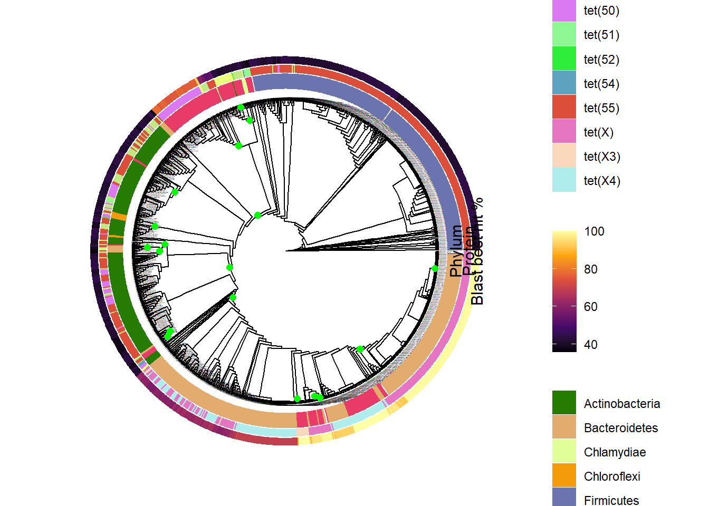

<!-- README.md is generated from README.Rmd. Please edit that file -->
# **README**

## **R code for: Parras-Moltó & , 2021**

This document describes the use of Analysis.R. The evolutionary process of Antibiotic resistance genes (ARGs) could be studied by the flow of genetic information between different phyla bacteria, what we call as events. Events are described as node-points within the tree with two branches that belong to at least two different phyla. Within this script we will use a tree based on the sequence aligment of ARGs of each class and their related taxonomy to define where events happens.

    R version 3.6.1 (2019-07-05)

### **Dependencies**

**Packages**

· `adephylo` v1.1.11. This package is devoted to exploratory analysis of phylogenetic comparative data. It re-implements and extends phylogenetic procedures from the ade4 package (which are now deprecated).

· `ape` v5.3. ape provides functions for reading, writing, manipulating, analysing, and simulating phylogenetic trees and DNA sequences, computing DNA distances, translating into AA sequences, estimating trees with distance-based methods, and a range of methods for comparative analyses and analysis of diversification. Functionalities are also provided for programming new phylogenetic methods.

· `data.table` v1.13.2. data.table inherits from data.frame. It offers fast and memory efficient: file reader and writer, aggregations, updates, equi, non-equi, rolling, range and interval joins, in a short and flexible syntax, for faster development.

· `ggnewscale` v0.4.4. Use multiple fill and colour scales in 'ggplot2.

· `ggplot2` v3.3.2. A system for 'declaratively' creating graphics, based on "The Grammar of Graphics". You provide the data, tell 'ggplot2' how to map variables to aesthetics, what graphical primitives to use, and it takes care of the details.

· `ggtree` v1.16.6. Visualizing phylogenetic tree and heterogenous associated data based on grammar of graphics ggtree provides functions for visualizing phylogenetic tree and its associated data in R.

· `phangorn` v2.5.5. Phylogenetic analysis in R (Estimation of phylogenetic trees and networks using Maximum Likelihood, Maximum Parsimony, Distance methods & Hadamard conjugation).

· `randomcoloR` v1.1.0.1. Simple methods to generate attractive random colors.

· `reshape2` v1.4.4. Flexibly restructure and aggregate data using just two functions: melt and 'dcast' (or 'acast').

· `stringr` v1.4.0. A consistent, simple and easy to use set of wrappers around the fantastic 'stringi' package. All function and argument names (and positions) are consistent, all functions deal with "NA"'s and zero length vectors in the same way, and the output from one function is easy to feed into the input of another.

**Files located in the same folder as the script**

1- tree\_file. Unrooted tree created following paper methods.

2- Taxonomy.txt. This file contains the taxonomy asociated to each sequence.

``` r
tab_resul<-read.delim("Taxonomy.txt",sep="\t",header=T,row.names = 1)
head(tab_resul)
##                                            superkingdom         phylum
## CP001778.1_seq1-Stackebrandtia_nassauensis     Bacteria Actinobacteria
## CP001814.1_seq1-Streptosporangium_roseum       Bacteria Actinobacteria
## FN650140.1_seq1-Legionella_longbeachae         Bacteria Proteobacteria
## EQ973223.1_seq1-Bacteroides_fragilis           Bacteria  Bacteroidetes
## CM000718.1_seq1-Bacillus_wiedmannii            Bacteria     Firmicutes
## CM000740.1_seq1-Bacillus_cereus                Bacteria     Firmicutes
##                                                          class
## CP001778.1_seq1-Stackebrandtia_nassauensis      Actinobacteria
## CP001814.1_seq1-Streptosporangium_roseum        Actinobacteria
## FN650140.1_seq1-Legionella_longbeachae     Gammaproteobacteria
## EQ973223.1_seq1-Bacteroides_fragilis               Bacteroidia
## CM000718.1_seq1-Bacillus_wiedmannii                    Bacilli
## CM000740.1_seq1-Bacillus_cereus                        Bacilli
##                                                          order
## CP001778.1_seq1-Stackebrandtia_nassauensis      Glycomycetales
## CP001814.1_seq1-Streptosporangium_roseum   Streptosporangiales
## FN650140.1_seq1-Legionella_longbeachae           Legionellales
## EQ973223.1_seq1-Bacteroides_fragilis             Bacteroidales
## CM000718.1_seq1-Bacillus_wiedmannii                 Bacillales
## CM000740.1_seq1-Bacillus_cereus                     Bacillales
##                                                          family
## CP001778.1_seq1-Stackebrandtia_nassauensis      Glycomycetaceae
## CP001814.1_seq1-Streptosporangium_roseum   Streptosporangiaceae
## FN650140.1_seq1-Legionella_longbeachae           Legionellaceae
## EQ973223.1_seq1-Bacteroides_fragilis             Bacteroidaceae
## CM000718.1_seq1-Bacillus_wiedmannii                 Bacillaceae
## CM000740.1_seq1-Bacillus_cereus                     Bacillaceae
##                                                        genus
## CP001778.1_seq1-Stackebrandtia_nassauensis    Stackebrandtia
## CP001814.1_seq1-Streptosporangium_roseum   Streptosporangium
## FN650140.1_seq1-Legionella_longbeachae            Legionella
## EQ973223.1_seq1-Bacteroides_fragilis             Bacteroides
## CM000718.1_seq1-Bacillus_wiedmannii                 Bacillus
## CM000740.1_seq1-Bacillus_cereus                     Bacillus
##                                                               species
## CP001778.1_seq1-Stackebrandtia_nassauensis Stackebrandtia nassauensis
## CP001814.1_seq1-Streptosporangium_roseum     Streptosporangium roseum
## FN650140.1_seq1-Legionella_longbeachae         Legionella longbeachae
## EQ973223.1_seq1-Bacteroides_fragilis             Bacteroides fragilis
## CM000718.1_seq1-Bacillus_wiedmannii               Bacillus wiedmannii
## CM000740.1_seq1-Bacillus_cereus                       Bacillus cereus
```

3- Blast\_Antibiotic\_analysis. Blast result against ResFinder database.

``` r
blast_results<-read.delim("Blast_Antibiotic_analysis",sep="\t",header=F)
head(blast_results)
##                                           V1                 V2     V3  V4  V5
## 1 CP001778.1_seq1-Stackebrandtia_nassauensis tet(55)_1_KR857689 41.888 339 193
## 2   CP001814.1_seq1-Streptosporangium_roseum tet(47)_1_KR857681 39.141 396 227
## 3     FN650140.1_seq1-Legionella_longbeachae tet(50)_1_KR857684 78.093 388  84
## 4       EQ973223.1_seq1-Bacteroides_fragilis    tet(X)_2_M37699 99.743 389   1
## 5        CM000718.1_seq1-Bacillus_wiedmannii tet(55)_1_KR857689 41.646 401 218
## 6            CM000740.1_seq1-Bacillus_cereus tet(55)_1_KR857689 41.103 399 222
##   V6 V7  V8 V9  V10       V11 V12
## 1  3  4 342 19 1023  1.44e-89 271
## 2  3  4 399 97 1242 1.87e-101 304
## 3  1  1 387  1 1164  0.00e+00 648
## 4  0  1 389  1 1167  0.00e+00 800
## 5  7  1 400  1 1158  1.16e-94 285
## 6  5  1 399  1 1158  1.41e-85 262
```

4- Total\_isolation.txt. Here we have all the metadata for all sequences.

``` r
isolation=as.data.frame(fread("Total_isolation.txt",header=F,sep="\t",na.strings=c("","NA")))
head(isolation)
##                                                                                                                                                                                                                        V1
## 1 0064P0001D04_3' library 64 - subtracted (Single juvenile learning minus single male silent control) - male Taeniopygia guttata cDNA clone 0064P0001D04 3' similar to Na+ dependent glucose transporter 1, mRNA sequence
## 2 0064P0001D04_5' library 64 - subtracted (Single juvenile learning minus single male silent control) - male Taeniopygia guttata cDNA clone 0064P0001D04 5' similar to Na+ dependent glucose transporter 1, mRNA sequence
## 3                                                                                   0088F Pyrococcus furiosus l-ZAP II library, F Robb Pyrococcus furiosus DSM 3638 cDNA clone 0088 similar to Na+ -ATPase, mRNA sequence
## 4                                                                                                                               011D03LLI0002B Lawsonia library Lawsonia intracellularis genomic, genomic survey sequence
## 5                                                                         0184F Pyrococcus furiosus l-ZAP II library, F Robb Pyrococcus furiosus DSM 3638 cDNA clone 0184 similar to Na+ -ATPase subunit D, mRNA sequence
## 6                                                                0185R Pyrococcus furiosus l-ZAP II library, F Robb Pyrococcus furiosus DSM 3638 cDNA clone 0185 similar to Na+ -ATPase subunit beta chain, mRNA sequence
##         V2                                                       V3
## 1 DV582547 note|clone|sex|tissue_type|clone_lib|dev_stage|note|note
## 2 DV582548 note|clone|sex|tissue_type|clone_lib|dev_stage|note|note
## 3   W36107       strain|note|type_material|clone|clone_lib|lab_host
## 4 BH795466                                           note|clone_lib
## 5 AA080740       strain|note|type_material|clone|clone_lib|lab_host
## 6 AA080742       strain|note|type_material|clone|clone_lib|lab_host
##                                                                                                                                                                                                                                                                                                                                                                                                                                                                             V4
## 1                           Organ: brain; Vector: pFLC-1; Site_1: EcoRI; Site_2: BamHI; The library was constructed as described by Carninci, P. (2003) in DNA Microarrays: A Molecular Cloning Manual, eds. Bowtell, D. & Sambrook, J. (Cold Spring Harbor, NY), pp. 647-670.|0064P0001D04|male|brain|SAMN00177110 library 64 - subtracted (Single juvenile learning minus single male silent control) - male|juvenile|TAG_SEQ=gatccaaggctaatttttttttt|TAG_TISSUE=whole brain
## 2                  Organ: brain; Vector: pFLC-1; Site_1: EcoRI; Site_2: BamHI; The library was constructed as described by Carninci, P. (2003) in DNA Microarrays: A Molecular Cloning Manual, eds. Bowtell, D. & Sambrook, J. (Cold Spring Harbor, NY), pp. 647-670.|0064P0001D04|male|brain|SAMN00177110 library 64 - subtracted (Single juvenile learning minus single male silent control) - male|juvenile|TAG_SEQ=tcgagctctaccaggtgacacactagaaccag|TAG_TISSUE=whole brain
## 3 DSM 3638|Vector: l-ZAP II; Site_1: Eco RI; Site_2: Eco RI; Genomic DNA was purified from P. furiosus cells and partially digested with Dra I, Eco RV, Hinc II, Pvu II, size selected, ligated to Eco RI linkers then cloned into the Eco RI site of l-ZAP II, plasmid excision vector. Excision was performed in batch and individual clones retrieved by plating.|type strain of Pyrococcus furiosus|0088|SAMN00165999 Pyrococcus furiosus l-ZAP II library, F Robb|E. coli
## 4                                                                                                                                                                                                                                                                                                                                                                                                                    Vector: pUC18; Site_1: SmaI|SAMN00182090 Lawsonia library
## 5 DSM 3638|Vector: l-ZAP II; Site_1: Eco RI; Site_2: Eco RI; Genomic DNA was purified from P. furiosus cells and partially digested with Dra I, Eco RV, Hinc II, Pvu II, size selected, ligated to Eco RI linkers then cloned into the Eco RI site of l-ZAP II, plasmid excision vector. Excision was performed in batch and individual clones retrieved by plating.|type strain of Pyrococcus furiosus|0184|SAMN00165999 Pyrococcus furiosus l-ZAP II library, F Robb|E. coli
## 6 DSM 3638|Vector: l-ZAP II; Site_1: Eco RI; Site_2: Eco RI; Genomic DNA was purified from P. furiosus cells and partially digested with Dra I, Eco RV, Hinc II, Pvu II, size selected, ligated to Eco RI linkers then cloned into the Eco RI site of l-ZAP II, plasmid excision vector. Excision was performed in batch and individual clones retrieved by plating.|type strain of Pyrococcus furiosus|0185|SAMN00165999 Pyrococcus furiosus l-ZAP II library, F Robb|E. coli
##     V5   V6   V7 V8 V9  V10
## 1 <NA> <NA> <NA> NA NA <NA>
## 2 <NA> <NA> <NA> NA NA <NA>
## 3 <NA> <NA> <NA> NA NA <NA>
## 4 <NA> <NA> <NA> NA NA <NA>
## 5 <NA> <NA> <NA> NA NA <NA>
## 6 <NA> <NA> <NA> NA NA <NA>
```

5- isolation\_criteria.txt. Each isolation cluster is defined in this file.

``` r
isolation_criteria<-read.table("isolation_criteria.txt", na.strings=c("","NA"),row.names = 1,sep = '\t',header = F)
```

6- isolation\_exclusion\_criteria.txt. In this list we have all the terms that are excluded from any group to avoid ambiguity.

``` r
isolation_exclusion_criteria<-read.table("isolation_exclusion_criteria.txt", na.strings=c("","NA"),row.names = 1,sep = '\t',header = F)
```

The sript will calculate all events a circular tree is plotted using all the information we have for each sequence: Taxonomy, Percentage blast similarity, most related protein name, pathogenicity and if they are plasmids.



Output results are found in three different files:

1- Metadata\_sequences\_info.txt. This file contains all the important information for each sequence, like Blast similarity percentage, taxonomy or isolation source info.

``` r
head(aux_table_results3)
##                                                    Phylum    Related protein
## CP001778.1_seq1-Stackebrandtia_nassauensis Actinobacteria tet(55)_1_KR857689
## CP001814.1_seq1-Streptosporangium_roseum   Actinobacteria tet(47)_1_KR857681
## FN650140.1_seq1-Legionella_longbeachae     Proteobacteria tet(50)_1_KR857684
## EQ973223.1_seq1-Bacteroides_fragilis        Bacteroidetes    tet(X)_2_M37699
## CM000718.1_seq1-Bacillus_wiedmannii            Firmicutes tet(55)_1_KR857689
## CM000740.1_seq1-Bacillus_cereus                Firmicutes tet(55)_1_KR857689
##                                            % Similarity Isolation
## CP001778.1_seq1-Stackebrandtia_nassauensis       41.888      soil
## CP001814.1_seq1-Streptosporangium_roseum         39.141      <NA>
## FN650140.1_seq1-Legionella_longbeachae           78.093      <NA>
## EQ973223.1_seq1-Bacteroides_fragilis             99.743      <NA>
## CM000718.1_seq1-Bacillus_wiedmannii              41.646      <NA>
## CM000740.1_seq1-Bacillus_cereus                  41.103      <NA>
##                                               Isolation_cluster NA1 NA2
## CP001778.1_seq1-Stackebrandtia_nassauensis Soil, , , , , , , ,   NA  NA
## CP001814.1_seq1-Streptosporangium_roseum                   <NA>  NA  NA
## FN650140.1_seq1-Legionella_longbeachae                     <NA>  NA  NA
## EQ973223.1_seq1-Bacteroides_fragilis                       <NA>  NA  NA
## CM000718.1_seq1-Bacillus_wiedmannii                        <NA>  NA  NA
## CM000740.1_seq1-Bacillus_cereus                            <NA>  NA  NA
```

2- Events\_results.txt. This is the table that sum up all the information regarding events. All node events are described here, and we can see which are their leaves and associated taxonomy, among other realted information.

3- Events\_results\_min.txt. This is the same table as before but with minimun information to make it more readable.
